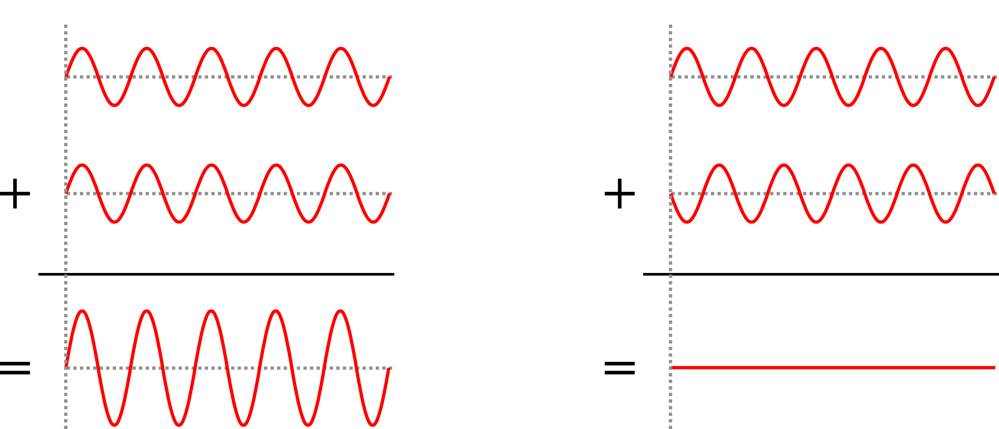

My research focuses on using Optical Coherence Tomography (OCT) to image biological samples. In this post I am going to explain the principle and limitations of traditional OCT.

## What is the purpose of OCT?

OCT is an imaging technique used to acquire images in scattering samples with *micrometer resolution* (smaller than a hair!). A scattering sample is a sample that *interacts* with light, in the sens that, during the propagation of light inside it, the light will not travel straight but will be deviated (possibly multiple times). We can highlight this phenomenon with clouds, take a look at the following picture:

{: .center-image }

In this example we can distinguish 3 cases for the propagation of light:

1. **Ballistic** light, this light is not scattered even once. You can clearly see the mountain. In order to image ballistic light you can use a basic camera.
2. **Single scattered** light, this light as been scattered exactly once (on average). It is still possible to see through (because some photons are still not scattered, scattering is a random process!). In order to image in single scattering media it is still possible to use a basic camera and a little bit of post processing can do the trick to improve the image quality.
3. **Multiple scattered** light, this light as been scattered multiple times and it is not possible to see through anymore with conventional imaging method.

This is for this third case that OCT is useful, it can distinguish between multiple scattered light and ballistic light. It can therefore extract only the ballistic light by filtering the multiple scattered light and allow us to image inside scattering media, that is to say, image the mountain behind the clouds. The limit being the amount of collected light that has not been scattered, which decreases with the imaging depth and the scattering power of the sample. There are several techniques that can image inside scattering media, the best famous being medical ultrasound imaging. The main difference between ultrasound and OCT is the resolution, because ultrasound uses mechanical waves with greater wavelength, the resolution is around 1 millimeter, which is $100 \sim 1000$ times lower than OCT.

## How does it work?

OCT can be thought as the optical version of medical ultrasound. In medical ultrasound imaging, an ultrasonic pulse is sent inside the medium, the sound propagates and might be reflected by different structures inside the medium. These reflections are recorded by the ultrasonic probe. For each detected echoes the time between the emission and the reception is measured and converted into a distance (assuming constant velocity). By laterally scanning it is then possible to reconstruct an image of the medium. It would be nice to be able to do the same with light but it is not possible. Indeed, the speed of light is so fast that we can not measure accurately the time between the emission and the reception. To overcome this problem, the idea is to use a typical property of light: **coherence**. Lets consider that we have two light beams $S_1$ and $S_2$:

$$ S_1 = A_1 cos(wt+\phi_1) $$

$$ S_2 = A_2 cos(wt+\phi_2) $$

Where $A_1$ and $A_2$ are the amplitudes, $w$ is the pulsation, $\phi_1$ and $\phi_2$ are the phases (you don't need to know these to understand what follows). If we sum these two waves we can have different results depending on the phase difference $\Delta \phi = \phi_1 - \phi_2$. Two examples are shown on the following figure.

{: .center-image }

On the left you have what we would call a constructive summation and on the right a destructive summation (it is also possible to obtain a partial constructive summation). For OCT to work the two beams need to be coherent, which requires a coherent source of light and to be careful when designing the optical system. Traditional OCT typically uses laser sources. I made an animation to represent how it works, see below. First, the laser beam is splitted in two, one beam is sent inside the sample and the other one is reflected by a mirror, which we call the reference mirror. The idea is then to look at the coherent summation between the two beams, that produces interferences. The trick is that only the light that was reflected inside the sample at a distance (the correct term would be the optical path length) that matches the distance with the mirror can produce interferences. So if we shift the mirror then it is possible to acquire a line (called A-Scan). By moving the sample laterally it is then possible to reconstruct an image of the sample reflectivity in 2D or 3D.

<iframe width="560" height="315" src="https://www.youtube.com/embed/yHVU5-zMBNE?rel=0" frameborder="0" allow="accelerometer; autoplay; encrypted-media; gyroscope; picture-in-picture" allowfullscreen></iframe>

This was the explanation for time domain OCT, there are a lot of variants to increase the acquisition speed (some tricks to avoid moving the reference mirror and some parts to shift the beam rather than the sample) but the idea behind it remains the same.

## Limitations of OCT

The first limitation is the acquisition speed. If one wants high lateral resolution then it requires to perform small lateral shifts leading to a trade off between the field of view and the resolution. Also, the properties of traditional OCT due to its optical design implies that the maximal lateral resolution (as opposed to its axial resolution) is *bad* (far from *diffraction limit*). The low numerical aperture required to penetrate deep enough inside samples to reconstruct signals is limiting the axial resolution. Traditional OCT are therefore perfectly fitted when requiring high axial resolution and medium lateral resolution, that is why it is heavily used by ophtalmologists who want to see the different retina layers which are axialy spaced by only several micrometers, see this post cover image.

To overcome these limitations, our team at Institut Langevin developped the full field version of OCT, which I will cover in another post soon (edit: [here](https://www.jscholler.com/2019-01-18-ffoct/))
