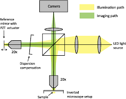

In this post I will describe the functionning of Full Field Optical Coherent Tomography (FFOCT). If you don't know about OCT I suggest that you should read my previous post [here](https://www.jscholler.com/2018-12-26-optical-coherence-tomography/).

## What is Full Field OCT?

Full field OCT is the parallel version of OCT, instead of acquiring axial lines in the sample and then scan spatially to reconstruct 2D images (BScan) or 3D volumes (CScan), FFOCT uses a camera to acquire directly a 2D plane, perpendicular to the illumination. FFOCT works quite the same way as a conventionnal *full field* microscope, hense its name. One of the advantage of FFOCT compared to traditionnal OCT is its simplicity, due to the absence of scanning. Also, acquiring a full frame in one shot is often better, especially for moving samples suche as the eye.

## Experimental setup and image formation

{: .center-image }

An LED is used as light source and splitted into the reference and sample arm (yellow on the figure above) by a beam splitter. The light is reflected by the reference mirror without any modification on its shape (that's why we call it the reference arm). On the contrary the light is reflected (possibly multiple times) by different layers inside the sample. Lights are collected from both arms and send on the camera sensor. The intensity recorded by the camera can be written:

$$ I_{camera}(x,y) = I_{incoh}(x,y) + 2\sqrt{R_s(x,y) R_r}cos(\Delta \phi(x,y)) $$

Where $I_{incoh}(x,y)$ is the incoherent light intensity that can not produce interference because the optical path length is different in the reference and in the sample arm, $R_s(x,y)$ is the reflectivity of the sample (**basically that's what we want to image!**), $R_r$ is the reference mirror reflectivity (we assume that it is constant for any position $(x,y)$), and $\Delta \phi(x,y)$ is the phase difference between the reference and sample coherent light.

The problem now is to extract $R_s(x,y)$ to construct the sample image. With only one image it is not possible because we have more unknowns than equations (we say that the problem is *ill-posed*). In order to construct an image we need at least a second image, but not the same. The trick is to change $\Delta \phi(x,y)$, the phase difference between the reference and the sample, and only this quantity. To do that we mounted the reference mirror on a piezoelectric transducer that as the property to contract or expand when a voltage is applied on it. By applying the correct voltage we can therefore change the distance that the light has to travel in the reference arm, thus change the optical path leading to a shifted phase $\Delta \phi(x,y)$.

#### 2-phase scheme

If we shift the reference mirror by $\frac{\lambda}{4}$, $\lambda$ being the source central wavelength, then we add a $\pi$ shift to the phase difference and the acquired images can be written:

$$ I_{1}(x,y) = I_{incoh}(x,y) + 2\sqrt{R_s(x,y) R_r}cos(\Delta \phi(x,y)) $$
$$ I_{2}(x,y) = I_{incoh}(x,y) + 2\sqrt{R_s(x,y) R_r}cos(\Delta \phi(x,y)+\pi) $$
$$ I_{2}(x,y) = I_{incoh}(x,y) - 2\sqrt{R_s(x,y) R_r}cos(\Delta \phi(x,y))$$

Now substracting the two images and taking the modulus we obtain:

$$ I_{2-phase} = |I_{1}(x,y)-I_{2}(x,y)| = 4\sqrt{R_s(x,y) R_r}|cos(\Delta \phi(x,y))| $$

In this expression the sample phase $\Delta \phi(x,y)$ and the reflectivity $R_s$ are mixed. For some samples where the phase is random (in time and space) it is sufficient but for some application one can be interested in extracting the phase.

#### 4 phase scheme

By taking 4 images it is possible to extract both the reflectivity $R_s$ and the phase difference $\Delta \phi(x,y)$. For a 4-phase scheme we apply $\{\frac{3\pi}{2},\pi,\frac{pi}{2},0\}$ and we obtain respectively $\{I_1(x,y),I_2(x,y),I_3(x,y),I_4(x,y)\}$. We can then reconstruct the sample reflectivity as:

$$ R_s(x,y) \propto \frac{1}{2}\sqrt{(I_4-I_2)^2+(I_1-I_3)^2} $$

The phase difference can be computed as:

$$ \Delta \phi(x,y) = arg((I_4-I_2)+i(I_3-I_1)) $$

*The demonstration is left for the reader* (Finally my dream comes true!).

#### Signal to noise ratio

For a 2-phase scheme it is not possible to un-mix amplitude and phase. To get rid of the cosine term we consider that the phase is uniformly distributed (both in time and space) in biological samples and we can average $I_{2-phase}$ with respect to the phase distribution:

$$ < I_{FFOCT} > =\eta I_0\sqrt{R\alpha}\frac{1}{2\pi}\int_0^{2\pi} |cos(\Delta \phi)|d\Delta \phi =\frac{2\eta I_0\sqrt{R\alpha}}{\pi} $$

Returning to the recorded intensity $\left{I_1, I_2\right}$, the terms related to sample arm reflectivity are negligible compared to the incoherent and reference terms so the intensity corresponding to pixel saturation $I_{sat}$ can be written:

$$ I_{sat} \approx \frac{\eta I_0}{4}(\alpha  + R_{incoh}) $$

Combining the previous we obtain:

$$ < I_{FFOCT} > = \frac{8I_{sat}\sqrt{R\alpha}}{\pi \left(\alpha+R_{incoh}\right)} $$

If we consider an ideal case when the experiment is shot noise limited, the noise is proportional to $\sqrt{I_{sat}}$, which gives the following signal to noise ratio:

$$ SNR_{2-phase} &\sim \frac{8\sqrt{R\alpha I_{sat}}}{\pi \left(\alpha+R_{incoh}\right)} \propto \sqrt{I_{sat}} $$

The SNR is proportional to $\sqrt{I_{sat}}$ and is therefore proportional to the maximal number of photoelectrons that a pixel can generate before saturation, which is the definition of the full well capacity. Thus the SNR is proportional to the FWC for a 2-phase FFOCT image.

## To go further

Some more information concerning FFOCT:
- There is a risk with FFOCT that adjecent pixels interfer and add speckle noise on images. In order to avoid that we only use spatially incoherent light source (e.g. LED and halogen lamp) where 2 different point of the source can't interfere.
- As we image deeper inside the sample the light in the reference arm travels faster/slower (depending on the microscope objectives used) than in the reference arm because the sample refractive index $n$ is not exactly the same as the reference arm refractive index (could be air or water/oil for immersion objectives). This leads to a shift between the focus position of the microscope and the coherence position. This shift decreases the interference signals we can probe and must be corrected by shifting the whole reference arm to adapt the optical path length.
