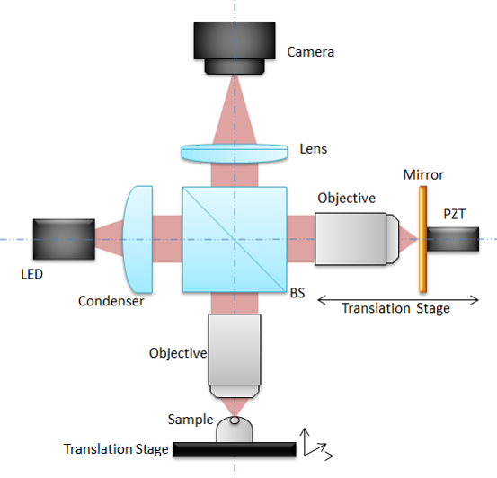

In this post I will describe the functionning of Full Field Optical Coherent Tomography (FFOCT). If you don't know about OCT I suggest that you should read my previous post [here](https://www.jscholler.com/2018-12-26-optical-coherence-tomography/).

## What is Full Field OCT?

Full field OCT is the parallel version of OCT, instead of acquiring axial lines in the sample and then scan spatially to reconstruct 2D images (BScan) or 3D volumes (CScan), FFOCT uses a camera to acquire directly a 2D plane, perpendicular to the illumination. FFOCT works quite the same way as a conventionnal *full field* microscope, hense its name. One of the advantage of FFOCT compared to traditionnal OCT is its simplicity, due to the absence of scanning. Also, acquiring a full frame in one shot is often better, especially for moving samples suche as the eye.

## Experimental setup

{: .center-image }

An LED is used as light source and splitted into the reference and sample arm (yellow on the figure above) by a beam splitter. The light is reflected by the reference mirror without any modification on its shape (that's why we call it the reference arm). On the contrary the light is reflected (possibly multiple times) by different layers inside the sample. Lights are collected from both arms and send on the camera sensor. The intensity recorded by the camera can be written:
$$ I_{camera} = I_{incoh} + 2\sqrt{R_s R_r}cos(\Delta \phi) $$
