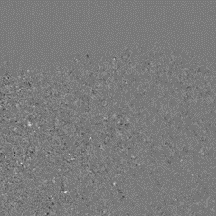
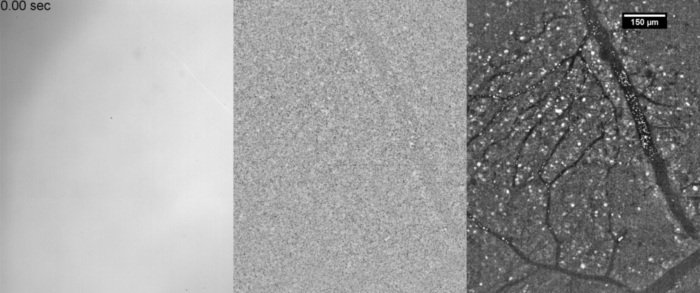
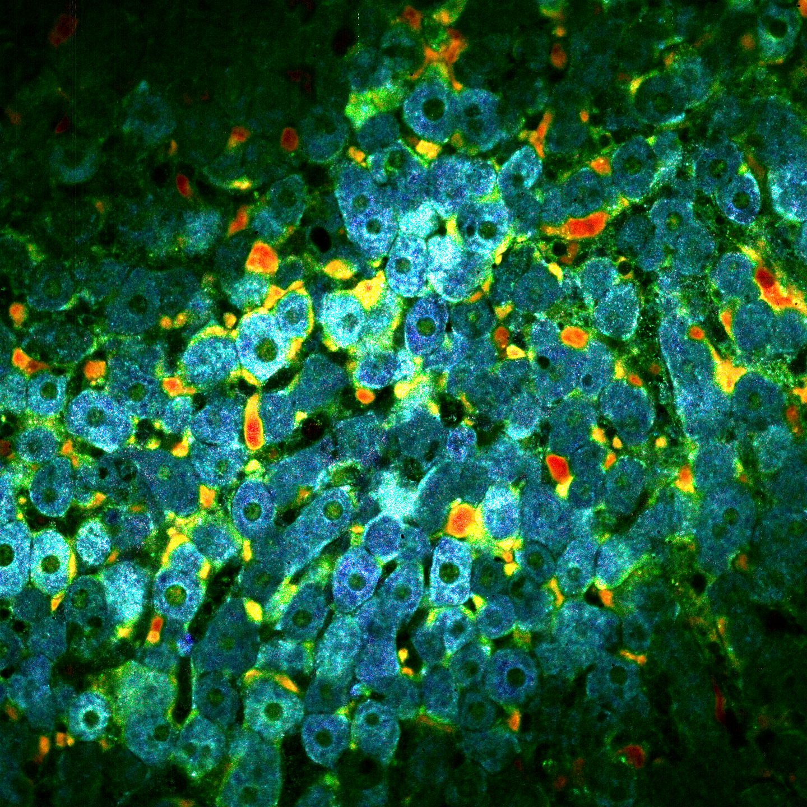

In this post I will describe the idea behind Dynamic Full Field Optical Coherent Tomography (DFFOCT). If you don't know about FFOCT I suggest that you should read my previous post [here](https://www.jscholler.com/2019-01-18-ffoct/).

## Why Dynamic FFOCT?

Let's say you are imaging a living organism, it could be either 3D tissue or cell cultures. Because there are sub-cellular motions and vibrations that creates local fluctuations then the back scattered signals should slightly vary in time. Remember the image formation equation for FFOCT:

$$ I_{direct}(x,y) = I_{incoh}(x,y) + 2\sqrt{R_s(x,y) R_r}cos(\Delta \phi(x,y)) $$

If the sample is fresh/alive then there is no reason why the coherent term should remain constant and the image formation equation becomes:

$$ I_{direct}(x,y,t) = I_{incoh}(x,y) + 2\sqrt{R_s(x,y,t) R_r}cos(\Delta \phi(x,y,t)) $$

The idea behind *DFFOCT* is to build an image based on these temporal fluctuations. We are referring to these images as dynamic images.

## Acquisition

In order to compute the dynamic image we need to acquire a lot of $I_{direct}(x,y,t)$ images because the fluctuations are so tiny we need to record long enough to separate the dynamic from the noise. The typical minimum number of frames required to compute a "*nice*" dynamic image is 512. Removing the mean it is possible to visualize these fluctuations:

{: .center-image }

We then need to transform this movie into a single dynamic image.

## Processing the movie

In order to measure the level of fluctuation we compute the temporal running standard deviation for each pixel, that is to say we cut the movie in sub movies and compute the standard deviation for each sub movie (see animation below in the middle). Then we average all these standard deviation and we end up with the image below on the right.

{: .center-image }

The idea is then to add colors based on the fluctuactions speed. From blue (slow) to red (fast). To do that we do a lot of processings to extract the motion speed and improve the image. These processings are not published yet so I'll explain them later. Finally we recombine each channel in order to contruct the dynamic image. Below you can fin an exemple on a mouse liver at $30 ~ \mu m$ depth.

{: .center-image }
