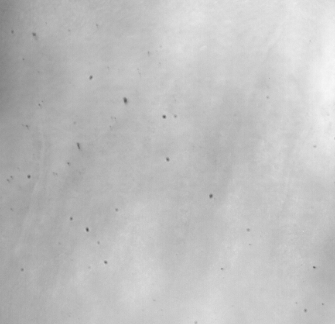

## How to remove dust in direct OCT image?


{: .center-image }

{: .center-image }

```python
import numpy as np
from skimage.io import imread
from skimage.filters import threshold_local
from skimage.morphology import opening, dilation, diamond
from skimage.external.tifffile import TiffWriter
import cv2

def save_as_tiff(data, filename, resolution=(0.22,0.22)):
    with TiffWriter(filename+'.tif', imagej=True) as tif:
        for i in range(data.shape[0]):
            tif.save(np.squeeze(data[i]), compress=0, resolution=resolution)

# Load data
if 'raw' not in locals():
    raw = imread('raw.tif')
    raw_mean = np.sum(raw, axis =0)
    
t = (raw_mean > threshold_local(raw_mean, block_size=21, offset=1000)).astype('uint8')
t = 1 - t
t = opening(t, selem=diamond(1))
t = dilation(t, selem=diamond(1))

raw_denoised = np.zeros(raw.shape)
for i in range(raw.shape[0]):
    raw_denoised[i] = cv2.inpaint(raw[i], t, 5, cv2.INPAINT_NS)
    
save_as_tiff(raw_denoised.astype('uint16'), 'denoised', resolution=(1,1))
```
