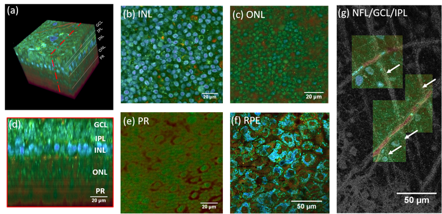

[ARVO meeting](https://www.arvo.org/annual-meeting/) is a conference focused on the eye. We presented our work during a 15 minutes presentation and with a poster.

**Purpose:** Dynamic FFOCT is a technique used to measure subcellular organelle dynamics in living cells at 3D micrometer resolution. Several issues were limiting the extensive use of dynamic FFOCT, starting with the computational load required to construct the images preventing any real time application. Here we propose a new workflow to compute images that is both faster and quantitative. The improvement in speed allows us to reach real time imaging in plane where we are able to image fluctuations in dynamics, up to 150 Hz, and tracking of subcellular organelles in retinal cells. The quantitative nature of the new methods allow us to obtain a consistent colormap where each color continuously codes for a dynamic frequency or decorrelation time that allows construction of 3D volumes and bigger ROIs by scanning samples in a panorama fashion with color consistency. We are testing and improving our signal processing methods on primate retinal explants, human iPS-derived retinal organoids and retinal cell cultures, with the aim of achieving non-invasive and label-free long term imaging in 3D samples with dynamic FFOCT, reproducing the type of quantitative information generally available only by immunofluorescence.

**Results:** We recorded time-lapse and 3D volumes on primate retinal explants, human iPS-derived retinal organoids and retinal cell cultures with millisecond resolution over several hours, non invasively revealing cellular processes such as apoptosis, division and differentiation. Such an amount of data would not reasonably be processed with post-processing methods as it represents several thousand terabytes of data. Dynamic imaging in macaque retinas showed cell structures in all layers including ganglion cell, inner and outer nuclear, and photoreceptor layers [3]. In organoids, we were able to follow cell processes non invasively in real time on a single organoid.

## Retinal explant

{: .center-image }
*(a) 3D reconstruction of a D-FFOCT image stack in explanted macaque retina over a 120 by 120 $\mu m$ field of view. Note that FFOCT signal is damped with increasing penetration depth, so that upper retinal layers are more clearly visible than lower ones. (b, c, e) En-face images of the (b) inner nuclear layer, (c) outer nuclear layer and (e) photoreceptor layer presenting a similar appearance to two-photon fluorescence imaging and (d) reconstructed cross-section at the location represented by the red dotted line in (a). The cross-section in (d) was linearly interpolated to obtain a unitary pixel size ratio. (f) D-FFOCT image of a porcine retinal pigment epithelium cell culture. (g) Overlay of colored D-FFOCT and FFOCT at the interface between the layers of the nerve fibers (white arrows point to nerve bundles that are very bright in static and invisible in dynamic mode), ganglion cells (blue and green cells, visible in dynamic mode) and inner plexiform (fibrous network, bottom left, visible in static mode). Samples were maintained in vitro in culture medium at room temperature during imaging.)*

[1] Jules Scholler, Viacheslav Mazlin, Olivier Thouvenin, Kassandra Groux, Peng Xiao, José-Alain Sahel, Mathias Fink, Claude Boccara, and Kate Grieve, "Probing dynamic processes in the eye at multiple spatial and temporal scales with multimodal full field OCT," Biomed. Opt. Express 10, 731-746 (2019)

## Human iPS-derived retinal organoids

### Slow timelapse (in the same locked plane)

Before real time the minimal frame time was around 30 seconds which is sufficient to study cell migration in a plane but not enough for 3D imaging and subcellular features tracking.

<iframe width="560" height="315" src="https://www.youtube.com/embed/WO-90vjs98A" frameborder="0" allow="accelerometer; autoplay; encrypted-media; gyroscope; picture-in-picture" allowfullscreen></iframe>

*In-depth stack of a 26-days-old retinal organoid*

<iframe width="560" height="315" src="https://www.youtube.com/embed/seZaHMkvCck" frameborder="0" allow="accelerometer; autoplay; encrypted-media; gyroscope; picture-in-picture" allowfullscreen></iframe>

*Timelapse of a 26-day-old organoid during 3 hours*

  <iframe width="560" height="315" src="https://www.youtube.com/embed/j3fpfTOdiro" frameborder="0" allow="accelerometer; autoplay; encrypted-media; gyroscope; picture-in-picture" allowfullscreen></iframe>

*Timelapse of a 29-day-old organoid during 3 hours*

### Fast timelapse with the proposed method

We imaged a 175 days old retina organoid. Resolution has been decreased in order to compress the presented movies. Original time resolution was **50 ms** (600 times faster than the previous method).

{: .center-image }
*Full field of view*

{: .center-image }
*Zoom 1*

{: .center-image }
*Zoom 2*

{: .center-image }
*Zoom 3*

## Retinal cell cultures

{: .center-image }
*Culture of porcine retinal pigment epithelial cells*

{: .center-image }
*Culture of porcine retinal pigment epithelial cells 3D rendering*

{: .center-image }
*Culture of porcine retinal pigment epithelial cells filaments on top*

