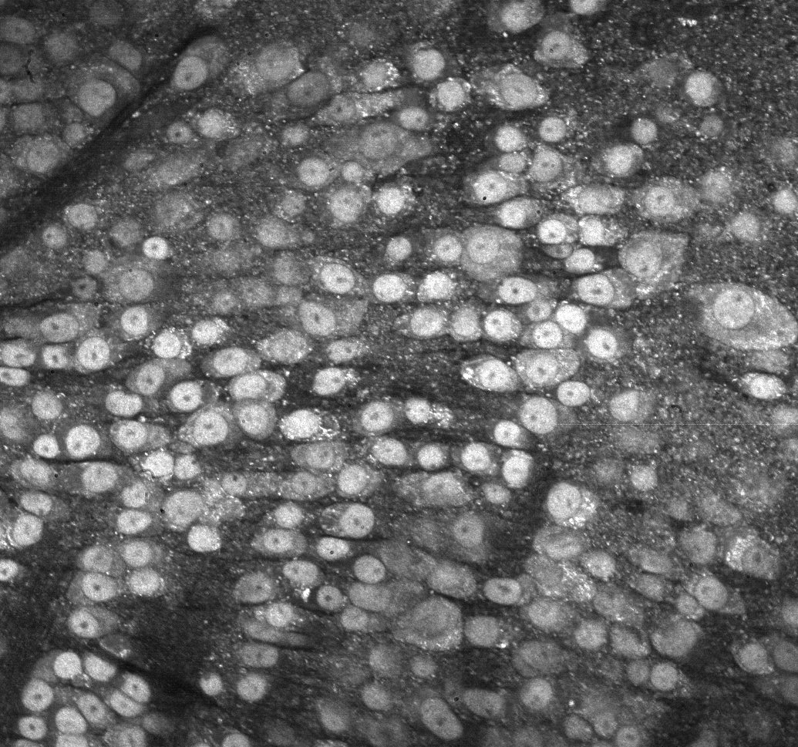

In this post I will explain how we can listen to living cells (yes dead cells are unfortunately silent) inside 3D tissues.

**Disclaimer:** we will not actually listen to actual sound waves created by cells and recorded by a microphone, but we are going to construct song based on cell activity.

## Signal recording

The technique used to probe the signals is **D**ynamic **F**ull-**F**ield **O**ptical **C**oherence **T**omography (D-FFOCT) which you can read about [here](https://www.jscholler.com/2019-01-28-dffoct/). As a reminder the experimental setup is displayed below:

{: .center-image }

The idea behind **O**ptical **C**oherence **T**omography (OCT) is the same as ultrasound imaging, the main difference being that it is not possible to generate and measure pulses in optics hence listen to light echoes. Therefore we need a smart way to discriminate light coming from several layers inside the sample. With OCT the smart idea is to generate interferences in the layer we aim to image. If you are not familiar with this you can learn more on OCT [here](https://www.jscholler.com/2019-01-28-ffoct/). In the figure above, the light coming from the reference will only interfere with the layer in the sample matching the optical path length. The width on-which the interferences can happen is given by the coherence length which is given by the source properties. For a Gaussian source the coherence length depends on the wavelength $\lambda$ and bandwidth:

$$ l_c \sim \frac{\lambda}{\delta \lambda^2} $$

Using phase-shifting strategies to remove background light coming from out-of-coherence layers we can reconstruct *en-face* images of the sample. Now, if instead of taking an image we record a movie, we can measure the fluctuations in each pixel and construct dynamic images. On these dynamic images it is possible to locate cells, for each cell it is possible to extract the raw fluctuation signals. By concatenating the raw signals contain in a single cell we can generate a song.

## How to go from several images to an actual song?

So the first step is to compute the image by computing the amplitude of fluctuations in each pixel during the movie, see the example below.

{: .center-image }
*Dynamic image of a mouse retina (ganglion cell layer)*

Then we need segment cells, that is to say we need to find the pixel belonging to each cell. To do that there are a bunch of algorithm and I used a machine learning approach, see segmentation results below.
