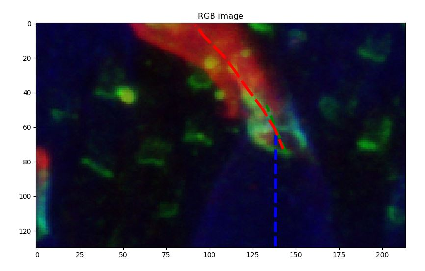

The fluorescence images and idea of this tutorial was proposed by Dr. Anna Verschueren:

*"This image shows macaque photoreceptors (cones) observed by immunofluorescence. To be able to distinguish the cell's different compartiment, fluorescent antibodies of different colors are used to specifically stain the outer segment (red), the inner segment (bleue) and their junction (green). One interesting hypothesis could be validated by observing the deformation of the outer segment compared to the inner segment orientation."*

## Aim of the tutorial

From an input fluorescence image of the photoreceptors (available here and shown at the top) we want to compute the deviation of each outer-segment (red part) with respect to their inner-segment (blue part).

For this tutorial you need the following libraries (if you installed Python with Anaconda you should have everything except Scikit-image):

- Numpy
- Scikit-image
- Matplotlib
- Scipy

You are free to choose your IDE but I recommend to use Spyder rather than Jupyter Notebook as it allows you to have a variable explorer to monitor your workspace.


## Step 1: load and display the data

The first step is to load and display the data. The data consists of a 3 dimensional array of shape $(1024,1024,4)$. The first image is not of interest in our application so we will just disregard it. Each $(1024,1024)$ array are representing fluorescent image in ``uint32``, the first being the blue, the second the green and the third the red. First, code a function to display each image in color separately like below.

{: .center-image }

In order to help you, I wrote two functions upon which you can draw inspiration:

```python
def gray2color(u,channel):
    """
    Compute color image from intensity in fluorescence in a given channel.
    Arguments:
    -----------
        u: np.ndarray
            Input fluorescence image (2D).
        channel: int
            Channel to code the image in (0: Red, 1: Green, 2: Blue).
    Returns:
    -----------
        u_color: np.ndarray
            The computed output image in color.
    """
    u_color = np.dstack((
        rescale_intensity(u if channel==0 else np.zeros_like(u), out_range='float'),
        rescale_intensity(u if channel==1 else np.zeros_like(u), out_range='float'),
        rescale_intensity(u if channel==2 else np.zeros_like(u), out_range='float'),
        ))
    return u_color
    
def display_initial_dataset(u):
    """
    Display initial image.
    Arguments:
    -----------
        u: np.ndarray
            Initial hyperstack given by Anna.
    """
    R = u[:,:,3]
    G = u [:,:,2]
    B = u[:,:,1]
    u_rgb = np.dstack((
        rescale_intensity(R, out_range='float'),
        rescale_intensity(G, out_range='float'),
        rescale_intensity(B, out_range='float')
        ))
    R_rgb = gray2color(R,0)
    G_rgb = gray2color(G,1)
    B_rgb = gray2color(B,2)
    fig, ax = plt.subplots(1,4,sharex=True,sharey=True)
    ax[0].imshow(u_rgb)
    ax[0].set_title('Original color image')
    ax[1].imshow(R_rgb)
    ax[1].set_title('Red channel')
    ax[2].imshow(G_rgb)
    ax[2].set_title('Green channel')
    ax[3].imshow(B_rgb)
    ax[3].set_title('Blue channel')
    return (ax, fig)
``` 

## Step 2: Automatically locate and segment outer segment

{: .center-image }

For this try to follow the following steps:

1. Threshold the red channel using one of the threshold function from Scikit-image.
2. Use morphology operators to improve the mask (fill holes and remove small objects)
3. Use the ``label`` and ``regionprops`` functions to identify each outer segment.


## Step 3: loop through the detected outer segment

At this step you should have each outer segment in a list with several properties computed by ``regionprops``. The goal is now to loop through the outer segment and ask the user to manually select some points using ``plt.ginput``. In order to help the user, you can then draw the different vectors that describe the direction of each part:

{: .center-image }

Then, compute the angle between each pairs of vectors. To do that we need to do a little bit of geometry. Given two points $a$ and $b$ with coordinates:

$$a=\binom{x_1}{y_1} \ \ b=\binom{x_2}{y_2}$$

The vector $\vec{ab}$ can then be written:

$$\vec{ab}=\binom{x_2-x_1}{y_2-y_1}$$

Computing the dot product between $\vec{ab}$ and $\vec{u_x}$ we have:

$$\vec{ab}.\vec{U_x} = ||\vec{ab}|| ||\vec{u_x}|| cos(\vec{ab},\vec{u_x})$$

Let's call $\alpha$ the angle between $\vec{ab}$ and $\vec{u_x})$, we can compute it with the following equation:

$$\alpha = arccos\left( \frac{x_2-x_1}{\sqrt{(x_2-x_1)^2+(y_2-y_1)^2}} \right)$$

## Solutions

The complete implementation will be given at the end of the tutorial.
