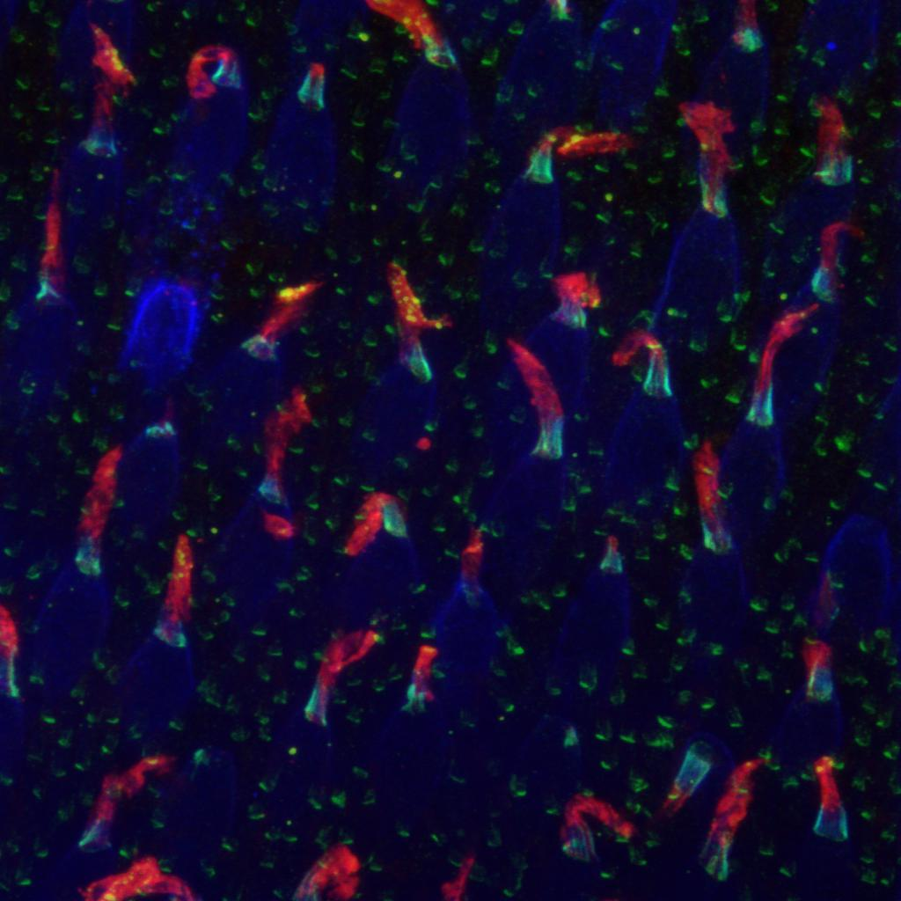

## Introduction

From an input fluorescence image of the photoreceptors we want to compute the deviation of the outer-segment (red part) with respect to the base (blue part). Also we want to compute the deviation of the green and the blue part.

{: .center-image }
