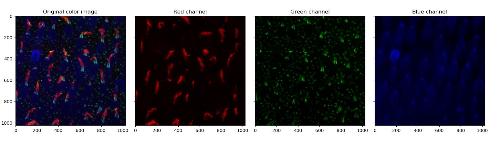

The fluorescence images and aim of this tutorial was proposed by Dr. Anna verschueren:

*"This image shows macaque photoreceptors (cones) observed by immunofluorescence. To be able to distinguish the cell's different compartiment, fluorescent antibodies of different colors are used to specifically stain the outer segment (red), the inner segment (bleue) and the calyceal processes at the outer and inner segment junction (green). The physiological role of calyceal processes is unknown, but its structure is known to be affected in pathologies as the Usher syndrome. One of the current hypothesis is their role as mechanical support for the base of the outer segment, a fragile area where photoreceptors are susceptible to mechanical stress. The question is to observe the deformation of the outer segment compared to the inner segment orientation, and to quantify if the presence of the calyceal processes constrict this deformation."*

## Aim of the tutorial

From an input fluorescence image of the photoreceptors (available here and shown at the top) we want to compute the deviation of the outer-segment (red part) with respect to the inner segment (blue part).

For this tutorial you need the following libraries (if you installed Python with Anaconda you should have everything except Scikit-image):

- Numpy
- Scikit-image
- Matplotlib
- Scipy


## Step 1: load and display the data

The first step is to load and display the data. The data consist of a 3 dimensional array of shape (1024,1024,4). The first image is not of interest in our application so we will just disregard it. Find a way to display each image in color separately like below.

{: .center-image }

```python
def gray2color(u,channel):
    """
    Compute color image from intensity in fluorescence in a given channel.
    Arguments:
    -----------
        u: np.ndarray
            Input fluorescence image (2D).
        channel: int
            Channel to code the image in (0: Red, 1: Green, 2: Blue).
    Returns:
    -----------
        u_color: np.ndarray
            The computed output image in color.
    """
    u_color = np.dstack((
        rescale_intensity(u if channel==0 else np.zeros_like(u), out_range='float'),
        rescale_intensity(u if channel==1 else np.zeros_like(u), out_range='float'),
        rescale_intensity(u if channel==2 else np.zeros_like(u), out_range='float'),
        ))
    return u_color
    
def display_initial_dataset(u):
    """
    Display initial image.
    Arguments:
    -----------
        u: np.ndarray
            Initial hyperstack given by Anna.
    """
    R = u[:,:,3]
    G = u [:,:,2]
    B = u[:,:,1]
    u_rgb = np.dstack((
        rescale_intensity(R, out_range='float'),
        rescale_intensity(G, out_range='float'),
        rescale_intensity(B, out_range='float')
        ))
    R_rgb = gray2color(R,0)
    G_rgb = gray2color(G,1)
    B_rgb = gray2color(B,2)
    fig, ax = plt.subplots(1,4,sharex=True,sharey=True)
    ax[0].imshow(u_rgb)
    ax[0].set_title('Original color image')
    ax[1].imshow(R_rgb)
    ax[1].set_title('Red channel')
    ax[2].imshow(G_rgb)
    ax[2].set_title('Green channel')
    ax[3].imshow(B_rgb)
    ax[3].set_title('Blue channel')
    return (ax, fig)
``` 

## Step 2: Automatically locate and segment outer segment

{: .center-image }

For this try to follow the following steps:
1) Threshold the red channel using one of the threshold function from Scikit-image.
2) Use morphology operators to improve the mask (fill holes and remove small objects)
3) Use the ``label`` and ``regionprops`` functions to identify each outer segment.


## Step 3: loop through the detected outer segment


## Solutions
