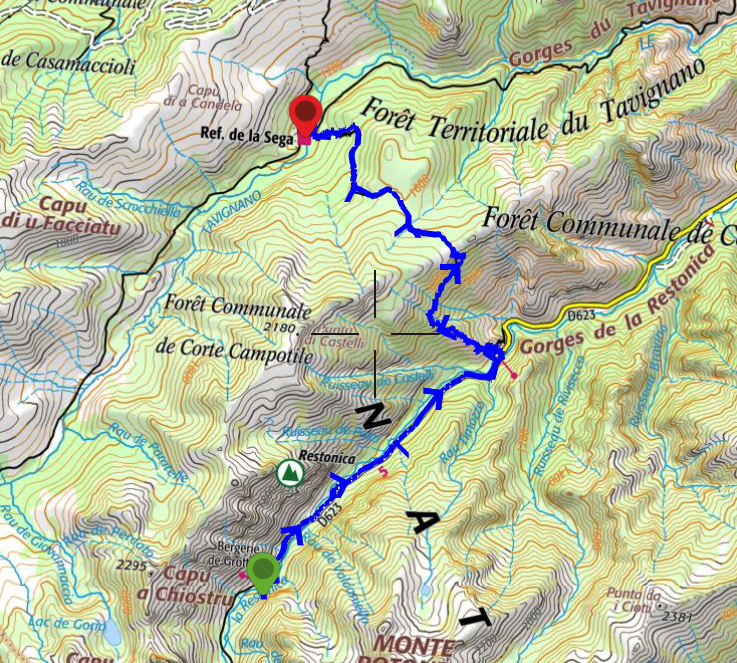
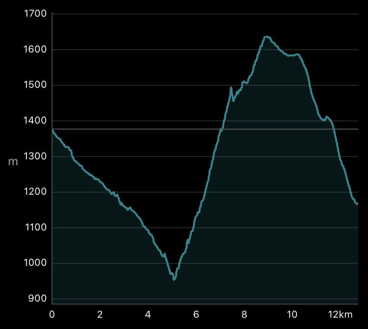
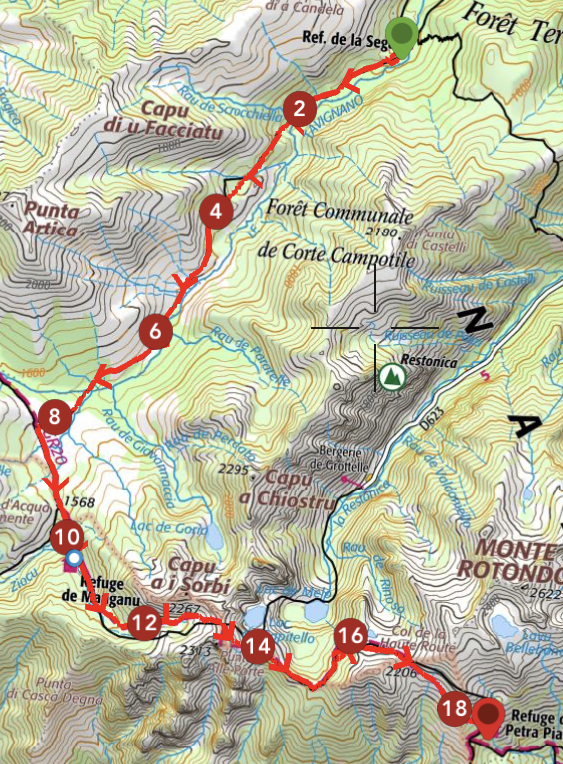
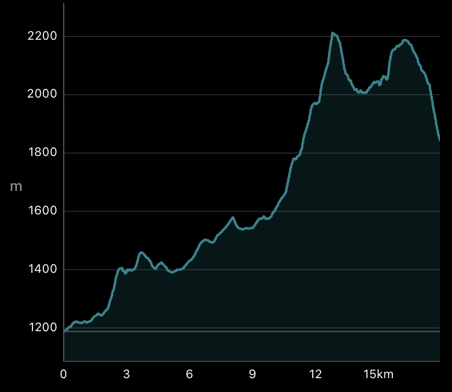
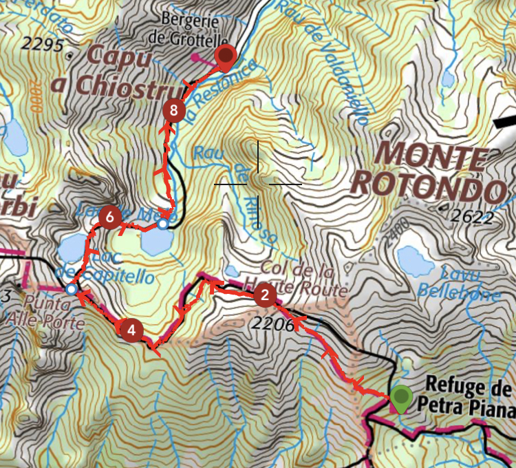
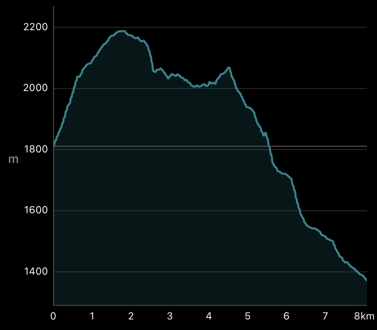

We have done this trip in October 2019 with a colleague after a summer school in Corsica. It is a 3 days hike in the very center of the island. In order to get there you will need a car and go to Corte, then take the D623 to the end of the Restonica Valley where you can park (6€/day). Our idea was to make a loop from the Valley to explore the surroundings, which are wonderful, see below for more details.

## Day 1: *Restonica Valley* to *Refuge de la Sega*

We started the first day around 10:30 from the *Bergerie de Grotelle*. It took us 6h to arrive at Refuge de la Sega.

| Distance [km] | Total Ascent [m] | Total Descent [m] |
| :-------------: |:-------------:| :-----:|
| 14.1 | 731 | 939 |

{: .center-image }

{: .center-image }

## Day 2: *Refuge de la Sega* to *Refuge de Manganu* to *Refuge de Pietra Piana*

| Distance [km] | Total Ascent [m] | Total Descent [m] |
| :-------------: |:-------------:| :-----:|
| 18.6 | 1362 | 706 |

{: .center-image }

{: .center-image }

## Day 3: *Refuge de Pietra Piana* to *Restonica Valley*

| Distance [km] | Total Ascent [m] | Total Descent [m] |
| :-------------: |:-------------:| :-----:|
| 8.8 | 441 | 881 |

{: .center-image }

{: .center-image }
