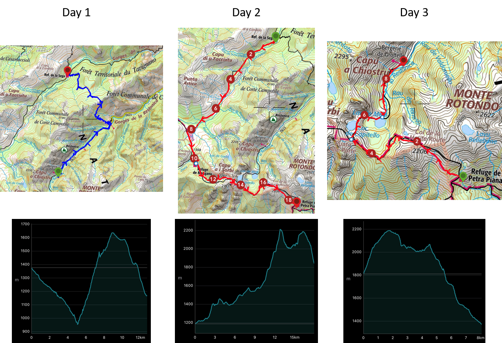

We have done this trip in October 2019 with a colleague after a summer school in Corsica. It is a 3 days hike in the very center of the island. In order to get there you will need a car and go to Corte, then take the D623 to the end of the Restonica Valley where you can park (6€/day). Our idea was to make a loop from the Valley to explore the surroundings, which are wonderful, see below for more details.

The maps for each day along with the corresponding elevation maps are shown below.
{: .center-image }

## Day 1: *Restonica Valley* to *Refuge de la Sega*

We started the first day around 10:30 from the *Bergerie de Grotelle*. It took us 6h to arrive at Refuge de la Sega. We started the first day around 10:30 from the *Bergerie de Grotelle*. It took us 6h to arrive at Refuge de la Sega. Hike description is summarized in the table below.

| Distance [km] | Total Ascent [m] | Total Descent [m] |
| :-------------: |:-------------:| :-----:|
| 14.1 | 731 | 939 |

## Day 2: *Refuge de la Sega* to *Refuge de Manganu* to *Refuge de Pietra Piana*

We started around 8:30 the second day after a gourmet breakfast (which lead to carrying much less weight on our backs!). We arrived around 11:30 at *Refuge de Manganu*, we had lunch there and went for *Refuge de Pietra Piana* where we arrived around 18:00. This day was quite hard, especially the afternoon as the terrain surface was very rough. There was a consistent need for hands in order to progress and climb up to *Brèche de Sorbo* and *Col de Rinoso*. Hike description is summarized in the table below.

| Distance [km] | Total Ascent [m] | Total Descent [m] |
| :-------------: |:-------------:| :-----:|
| 18.6 | 1362 | 706 |

-

<iframe width="560" height="315" src="https://www.youtube.com/embed/mZZa2ROloSM" frameborder="0" allow="accelerometer; autoplay; encrypted-media; gyroscope; picture-in-picture" allowfullscreen></iframe>

## Day 3: *Refuge de Pietra Piana* to *Restonica Valley*

| Distance [km] | Total Ascent [m] | Total Descent [m] |
| :-------------: |:-------------:| :-----:|
| 8.8 | 441 | 881 |

-

<iframe width="560" height="315" src="https://www.youtube.com/embed/ZQVBFwQg758" frameborder="0" allow="accelerometer; autoplay; encrypted-media; gyroscope; picture-in-picture" allowfullscreen></iframe>

