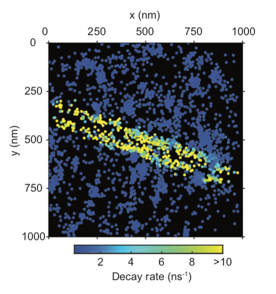

This work was done during my research internship when I was in my third year at ESPCI. I worked with Dorian Bouchet under the supervision of Ignacio Izeddin.

You can find our publication on [Arxiv](https://arxiv.org/abs/1809.02778).

### Purpose

Our aim was to measure the LDOS. Wait, what's that? The **L**ocal **D**ensity **O**f **S**tates (LDOS) is a physical quantity. It can be roughly understand as the number of states that can be occupied by a photon. It is space resolved, meaning that the LDOS depends on where you are on a medium, it is a local property that can explain material behavior. Indeed, the LDOS is involved in the way light can interacts with matter. The aim of the project was to image the LDOS in 2D (at the interface between two medium) with a super-resolution.

#### Super-resolution

So you may be wondering what this super-resolution is about. In optics, and in any field that uses waves, there is a physical limit called *diffraction* caused by the wave propagation. In practice, it means that if you are far (in optics you are far from something if you are further than an hair thickness) from what you image, then you cannot obtain a better resolution than the *difraction limit*. This has been a struggle for the pasts centuries, mainly in astronomy and microscopy. If you are interested you should read about it on [Wikipedia](https://en.wikipedia.org/wiki/Diffraction). It also holds for the light you may try to send. If you want to focus light, e.g. with a lens, the focus spot cannot be smaller than this diffraction limit. So what we wanted to do is to beat this diffraction limit. You may think, "But you said it was a physical limit, how can you beat physics?". Well, in fact you are right, you cannot beat physics, but you can use physics in a smarter way. So in order to beat the diffraction there is basically two kinds of methods:
- Near field
- Far field

Remember that the diffraction limit arises because of the **propagation** of light. So if you probe the light before, or shortly after, it starts to propagate, then you are no longer limited by the diffraction. The other set of methods, called *far field* uses some known properties to improve the resolution. In our project we used **S**tochastic **O**ptical **R**econstruction **M**icroscopy (STORM) which relies on the point spread function estimation. The diffraction transforms any point you may try to image into some larger function that we call point spread function (because it spreads the point!). If you know the point spread function (which is possible to calculate for any optical system) and you image something you know is a point (or a molecule which is so tiny that it can be considered a a point) then you can try to fit the point spread function on the image. Then, because physics tells you that the point spread function is centered on that point, you can estimate the center and replace the point spread function by a point. You can see an example of this technique on the following video, on the left you have a very blurred, *diffraction limited*, image - on the center you can observe the blinking PSF and on the right you can see the super-resolved reconstruction after fitting the point spread function.

<iframe width="560" height="315" src="https://www.youtube.com/embed/RE70GuMCzww" frameborder="0" allow="accelerometer; autoplay; encrypted-media; gyroscope; picture-in-picture" allowfullscreen></iframe>

The limitation is the number of photons collected, the less photons the more noise leading to uncertainty when you fit the point spread function. Also, you need to have **isolated** point spread function in order to estimate the center, so you need to control each point activation in the sample. The last part is not easy and the STORM inventors got a Nobel price for that in 2014.

### Back to purpose

So what we wanted to do was to image the LDOS with a super-resolution. It is possible to measure the LDOS because it interacts with light. When you excite a fluorophore, which is a molecule that can emit fluorescent photon when you excite it with light, the LDOS influences the possibility for the fluorophore to recover its ground state, i.e. when it is not excited. It modifies the probability function of fluorescent emission. So what we did is measure this probability by measuring the time between the excitation and the emission using a pulsed laser. We repeated the measurement numerous time for each molecule in order to construct the probability. In the mean time we recorded the image on a very sensitive camera to locate the emitters with a super resolution. We developed our proof of concept by imaging a silver nanowire that exhibits a very high LDOS compared to the glass where it was sitting. It was smaller than the diffraction limit and we imaged it with a better, *super* resolution.

