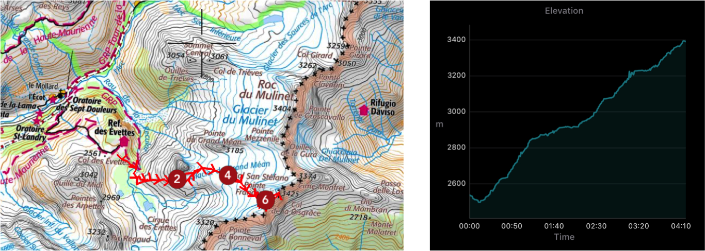

We have done this trip in August 2019 during summer holidays. It is a 2 days hike in the French Alps.

We started the ascent from *Refuge des Evettes* in order to save time (the goal was to reach the summit before midday in order to avoid difficulties on the glacier). We parked our car in *L'Êcot* and hiked to *Refuge des Evettes* the day before (there are several possibilities to get there), it took us around 1h30.

From *Refuge des Evettes* to *Pointe Francesetti* the details are shown below. It took us 4h to reach the summit, we took our time to enjoy the amazing landscapes (see the video below) and to put on the crampons on the Glacier. I would highly recommend this route as a first experience on a glacier. Be aware of the crevasse that can quickly form and do **not attempt** if the weather is not steady clear.

{: .center-image }

| Distance [km] | Total Ascent [m] | Total Descent [m] |
| :-------------: |:-------------:| :-----:|
| 6.6 | 984 | 128 |

-

<iframe width="560" height="315" src="https://www.youtube.com/embed/4fIISsZMYcg" frameborder="0" allow="accelerometer; autoplay; encrypted-media; gyroscope; picture-in-picture" allowfullscreen></iframe>

